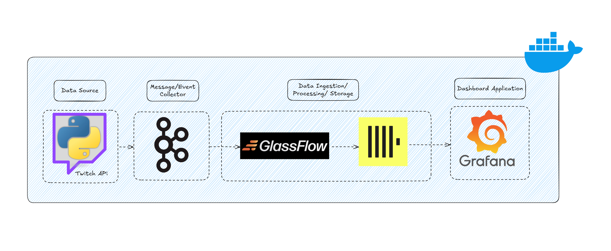
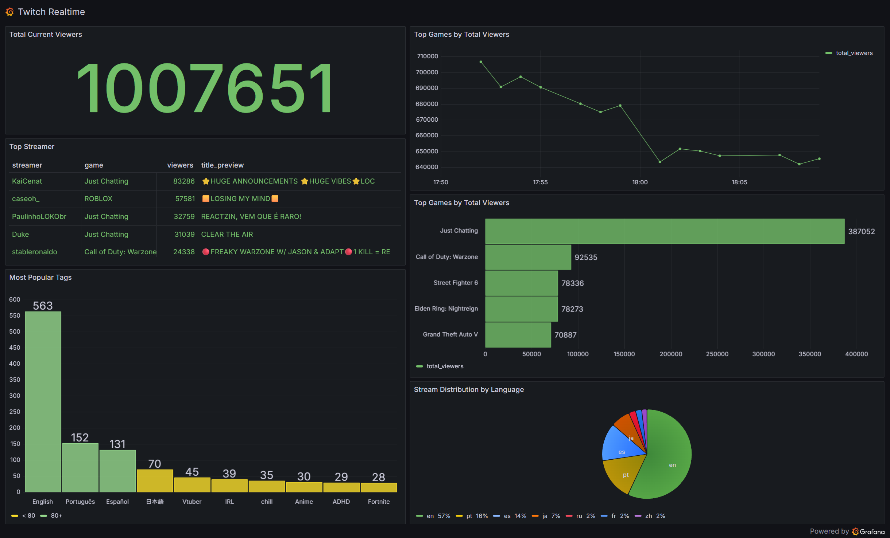

# Twitch Real-time Data Engineering Pipeline

A comprehensive real-time data engineering project that analyzes streaming data from Twitch to discover insights about gaming trends, viewer patterns, and broadcaster metrics through interactive dashboards.



## 🎯 Project Overview

This project implements a modern data engineering pipeline that:
- **Collects** real-time streaming data from Twitch API
- **Processes** data through Apache Kafka for stream processing
- **Stores** processed data in ClickHouse for analytical queries
- **Visualizes** insights through interactive Grafana dashboards
- **Monitors** data pipeline health and performance

## 🏗️ Architecture

The pipeline follows a modern streaming architecture pattern:

1. **Data Ingestion**: Python producer fetches data from Twitch API
2. **Stream Processing**: Apache Kafka handles real-time data streams
3. **Data Storage**: ClickHouse serves as the analytical database
4. **Data Transformation**: ETL processes enrich and clean the data
5. **Visualization**: Grafana provides real-time dashboards
6. **Infrastructure**: Docker containers orchestrate the entire stack

### Components

- **🎮 Twitch API Producer**: Fetches top games and streaming data
- **📨 Apache Kafka**: Message broker for stream processing
- **🗄️ ClickHouse**: Columnar database for analytics
- **📊 Grafana**: Dashboard and visualization platform
- **🔄 ETL Pipeline**: Data transformation and enrichment
- **🌐 Nginx**: Reverse proxy and load balancer
- **💾 NATS**: Message queuing system

## 📈 Dashboard Insights



The Grafana dashboard provides real-time insights into:
- **Top Games by Viewer Count**: Most popular games currently being streamed
- **Streaming Trends**: Viewer count patterns over time
- **Broadcaster Analytics**: Stream duration, language distribution, mature content ratio

## 🚀 Getting Started

### Prerequisites

- Docker and Docker Compose
- Python 3.10+
- Twitch Developer Account (for API credentials)

### Environment Setup

1. **Clone the repository**:
   ```bash
   git clone <repository-url>
   cd twitch-realtime-project
   ```

2. **Configure Twitch API credentials**:
   ```bash
   # Edit src/.env with your Twitch API credentials
   cp src/.env.example src/.env
   ```
   
   Update the following variables:
   ```
   APP_ID=your_twitch_app_id
   APP_SECRET=your_twitch_app_secret
   ```

3. **Start the infrastructure**:
   ```bash
   docker-compose up -d
   ```

4. **Install Python dependencies**:
   ```bash
   # Using uv (recommended)
   uv sync
   
   # Or using pip
   pip install -e .
   ```

### Database Setup

5. **Create ClickHouse tables**:
   
   Access ClickHouse client:
   ```bash
   # Option 1: Using Docker
   docker exec -it clickhouse clickhouse-client
   
   # Option 2: Using HTTP interface
   curl -X POST 'http://localhost:8123/' --data-binary @src/database/game_streams_enriched.sql
   ```
   
   Or create the table manually in ClickHouse:
   ```sql
   CREATE TABLE IF NOT EXISTS default.game_streams_enriched (
       stream_id String,
       user_id String,
       user_login Nullable(String),
       user_name Nullable(String),
       game_id String,
       game_name Nullable(String),
       stream_type Nullable(String),
       title Nullable(String),
       viewer_count Nullable(UInt32),
       started_at DateTime,
       language Nullable(String),
       is_mature Nullable(Bool),
       tags Nullable(String),
       broadcaster_type Nullable(String),
       user_description Nullable(String),
       user_created_at Nullable(DateTime),
       data_retrieved_at DateTime
   ) ENGINE = MergeTree
   PARTITION BY (data_retrieved_at, game_id)
   ORDER BY (stream_id, data_retrieved_at)
   TTL toDateTime(started_at) + toIntervalDay(14);
   ```

### Pipeline Setup

6. **Configure GlassFlow ETL Pipeline**:
   
   a. Access GlassFlow UI at http://localhost:8080
   
   b. Create a new pipeline with the following configuration:
      - **Source 1**: Kafka topic `game_streams` (raw stream data)
      - **Source 2**: Kafka topic `twitch_users` (user profile data)
      - **Transformation**: Join streams and users data on `user_id`
      - **Destination**: ClickHouse table `game_streams_enriched`
   
   c. Pipeline Configuration:
   ```yaml
   # Example GlassFlow pipeline configuration
   sources:
     - name: game_streams
       type: kafka
       topic: game_streams
       bootstrap_servers: kafka1:19092
     - name: twitch_users
       type: kafka
       topic: twitch_users
       bootstrap_servers: kafka1:19092
   
   transformations:
     - type: join
       left: game_streams
       right: twitch_users
       on: user_id
       type: left_join
   
   destination:
     type: clickhouse
     host: clickhouse
     port: 9000
     database: default
     table: game_streams_enriched
   ```
   
   📚 **For detailed GlassFlow step-by-step setup, see**: [docs/glassflow-setup.md](docs/glassflow-setup.md)
   
   📚 **For complete GlassFlow documentation, refer to**: https://github.com/glassflow/clickhouse-etl

### Running the Pipeline

7. **Start data ingestion**:
   ```bash
   cd src/producer
   python streams_producer.py
   ```

8. **Monitor the pipeline**:
   - **Kafka UI**: http://localhost:8088 - Monitor Kafka topics and messages
   - **GlassFlow UI**: http://localhost:8080 - Monitor ETL pipeline status
   - **ClickHouse**: http://localhost:8123 - Query the enriched data
   - **Grafana Dashboard**: http://localhost:3000 (admin/admin) - Visualize insights

### Data Verification

9. **Verify data flow**:
   
   Check Kafka topics have data:
   ```bash
   # Access Kafka UI at http://localhost:8088
   # Or use command line:
   docker exec -it kafka1 kafka-console-consumer --bootstrap-server localhost:19092 --topic game_streams --from-beginning --max-messages 5
   ```
   
   Query ClickHouse to verify enriched data:
   ```sql
   -- Connect to ClickHouse and run:
   SELECT COUNT(*) FROM default.game_streams_enriched;
   
   -- Check recent data:
   SELECT 
       game_name, 
       user_name, 
       viewer_count, 
       started_at
   FROM default.game_streams_enriched 
   ORDER BY data_retrieved_at DESC 
   LIMIT 10;
   ```

### Troubleshooting

**Common Issues:**

- **No data in ClickHouse**: Check GlassFlow pipeline status and logs
- **Kafka connection issues**: Verify Kafka is running and topics exist
- **API rate limits**: Check Twitch API credentials and rate limiting
- **Pipeline errors**: Check GlassFlow logs in the UI

**Useful Commands:**
```bash
# Check service status
docker-compose ps

# View logs
docker-compose logs -f kafka1
docker-compose logs -f clickhouse
docker-compose logs -f app

# Restart services
docker-compose restart
```

## 📊 Data Schema

### Streams Data
```sql
CREATE TABLE game_streams_enriched (
    stream_id String,
    user_id String,
    user_login Nullable(String),
    user_name Nullable(String),
    game_id String,
    game_name Nullable(String),
    stream_type Nullable(String),
    title Nullable(String),
    viewer_count Nullable(UInt32),
    started_at DateTime,
    language Nullable(String),
    is_mature Nullable(Bool),
    tags Nullable(String),
    broadcaster_type Nullable(String),
    user_description Nullable(String),
    user_created_at Nullable(DateTime),
    data_retrieved_at DateTime
) ENGINE = MergeTree
PARTITION BY (data_retrieved_at, game_id)
ORDER BY (stream_id, data_retrieved_at)
TTL toDateTime(started_at) + toIntervalDay(14)
```

## 🛠️ Technology Stack

| Component | Technology | Purpose |
|-----------|------------|---------|
| **Data Ingestion** | Python, TwitchAPI | Real-time data collection |
| **Message Broker** | Apache Kafka | Stream processing |
| **Database** | ClickHouse | Analytical data storage |
| **Visualization** | Grafana | Dashboard and monitoring |
| **ETL** | GlassFlow | Data transformation |
| **Infrastructure** | Docker, Nginx | Container orchestration |
| **Schema Registry** | Confluent Schema Registry | Data schema management |

## 🔧 Configuration

### Kafka Topics
- `game_streams`: Raw streaming data
- `twitch_users`: User profile information

### ClickHouse Tables
- `game_streams_enriched`: Main analytical table with enriched stream data

### Grafana Dashboards
- **Twitch Realtime Dashboard**: Main analytics dashboard

## 📁 Project Structure

```
├── docker-compose.yml          # Infrastructure orchestration
├── pyproject.toml             # Python dependencies
├── LICENSE                    # MIT License
├── src/
│   ├── producer/              # Data ingestion
│   │   ├── streams_producer.py
│   │   └── twitch_api.py
│   ├── database/              # Database schemas
│   │   └── game_streams_enriched.sql
│   └── dashboard/             # Grafana dashboards
│       └── twitch_realtime_dashboard.json
├── docker/                    # Docker configurations
│   ├── clickhouse/
│   ├── grafana/
│   └── nginx/
├── docs/                      # Documentation
│   └── glassflow-setup.md     # GlassFlow pipeline setup guide
├── data/                      # Persistent data storage
├── images/                    # Documentation images
│   ├── architecture.png
│   └── grafana.png
└── .gitignore                 # Git ignore rules
```

## 🔍 Monitoring and Observability

- **Pipeline Health**: Monitor data ingestion rates and processing latency
- **Data Quality**: Track data completeness and accuracy metrics
- **System Performance**: Monitor resource usage and response times
- **Business Metrics**: Track gaming trends and viewer engagement

## 🤝 Contributing

1. Fork the repository
2. Create a feature branch (`git checkout -b feature/amazing-feature`)
3. Commit your changes (`git commit -m 'Add amazing feature'`)
4. Push to the branch (`git push origin feature/amazing-feature`)
5. Open a Pull Request

## 📝 License

This project is licensed under the MIT License - see the [LICENSE](LICENSE) file for details.

## 🙏 Acknowledgments

- [Twitch API](https://dev.twitch.tv/docs/api/) for providing streaming data
- [ClickHouse](https://clickhouse.com/) for fast analytical queries
- [Apache Kafka](https://kafka.apache.org/) for stream processing
- [Grafana](https://grafana.com/) for beautiful visualizations

## 📞 Support

For questions and support, please open an issue on GitHub or contact the maintainers.

---

**Built with ❤️ for the gaming and data engineering community**